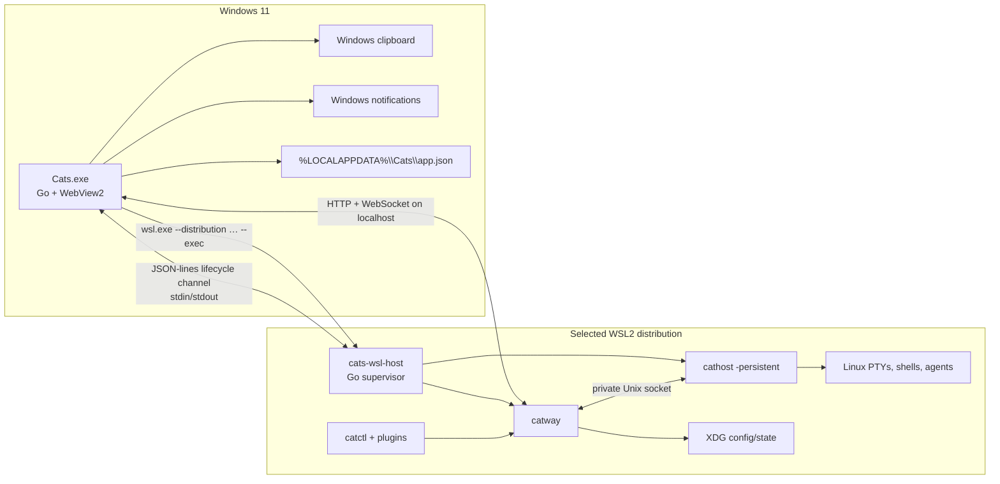

# CATS architecture differences: macOS and Windows 11/WSL2

- Status: proposed architecture
- Decision date: 2026-08-05
- Target: Windows 11 with WSL2; native Windows launcher; Linux workloads in WSL2

## Executive summary

The terminal application does not need to be ported to the Windows process
model. `catway`, `cathost`, `catctl`, PTYs, libghostty-vt, agent processes,
plugins, worktrees, and persisted sessions already have a Linux implementation
and will continue to run as Linux binaries inside WSL2.

The required platform port is the desktop shell. The current `cmd/catapp` is
Darwin-only and uses Cocoa, WebKit, Objective-C menus, `pbcopy`/`pbpaste`, a
macOS app bundle, and macOS application-data conventions. The Windows version
will remain a Go program but use the Windows backend already supported by
`github.com/webview/webview_go`: Edge WebView2. A small Go host helper inside
WSL2 will own and supervise the Linux daemons on behalf of the Windows launcher.

This keeps the application split at a natural boundary:



## What remains unchanged

The following code and behavior stay Linux-native and should require no
platform fork beyond WSL-specific tests and packaging:

- `cmd/catway`: HTTP/WebSocket UI server, session orchestration, auth, TLS,
  configuration, persistence, worktrees, plugins, usage, ACP chat, and control
  and hook APIs.
- `cmd/cathost`: PTY ownership and persistent terminal daemon behavior.
- `cmd/catctl`: CLI control, completions, integration installation, plugins,
  and probes. Users run it inside WSL or in a CATS pane.
- `internal/terminal` and vendored `libghostty-vt`: the existing
  `Linux/x86_64` and `Linux/aarch64` build paths apply to WSL2.
- `internal/detect/procscan_linux.go`: WSL2 exposes Linux `/proc`, process
  groups, PTYs, and process working directories.
- The browser, orchestration, control, and hook protocols.
- The embedded browser UI in `cmd/catway/web/index.html`.
- XDG state inside WSL: config, session/history, plugins, agent manifests,
  themes, credentials, and worktrees.
- Linux agent hooks. The `.ps1` assets are not needed when the agent itself
  runs inside WSL; the existing Unix integration installer is the correct path.

This scope deliberately means that panes run **WSL Linux commands and agents**.
Running native Windows shells or Windows-installed agents in panes is not part
of this version. That would be a separate backend requiring ConPTY, Windows
process discovery, Windows environment/path rules, named-pipe transports, and
Windows-native hook installers.

## Repository evidence for the split

This proposal is based on the repository at commit `44b0397`, not only on the
current product description:

- Every source file in `cmd/catapp` has a Darwin build constraint. Its menu is
  Objective-C/Cocoa, its clipboard adapter calls `/usr/bin/pbcopy` and
  `/usr/bin/pbpaste`, and its app-data directory is under `~/Library`.
- `scripts/build-macapp.sh` and the `macapp` Make targets only assemble `.app`
  bundles. There is no Windows resource, installer, launcher build, or release
  job.
- `scripts/build-libghostty-vt.sh` already supports `Linux/x86_64` and
  `Linux/aarch64`; `.github/workflows/ci.yml` already exercises the real tagged
  terminal path on Linux.
- `internal/detect/procscan_linux.go`, Linux host-memory parsing, Linux
  `statfs`, Unix sockets, and `github.com/creack/pty` cover the WSL backend
  requirements.
- `cmd/catway/web/index.html` already has launcher-neutral JavaScript binding
  names for native clipboard access and serves all primary application UI.
- The pinned `webview_go` module declares a Windows WebView2 backend even though
  this repository currently excludes `cmd/catapp` from Windows builds.

## Component differences

| Concern | Current standalone macOS version | Proposed Windows 11/WSL2 version | Required change |
|---|---|---|---|
| Desktop process | `catapp` is a Darwin Go binary | `Cats.exe` is a Windows Go binary | Refactor common launcher logic and add Windows files/build tags |
| Embedded engine | WKWebView through Cocoa/WebKit | Edge WebView2 | Use the Windows backend of the existing `webview_go` dependency |
| Terminal server | macOS `catway` binary | Linux `catway` ELF in WSL2 | Package a Linux payload; application logic unchanged |
| Terminal host | macOS PTYs and Darwin process scanner | Linux PTYs and `/proc` scanner in WSL2 | Application logic unchanged; add WSL acceptance coverage |
| Supervision | `catapp` directly starts sibling binaries | `Cats.exe` starts `cats-wsl-host` through `wsl.exe`; helper starts siblings | Add a versioned launcher/host lifecycle protocol |
| UI transport | macOS loopback HTTP/WebSocket | Windows-to-WSL localhost forwarding | Bind explicitly to `127.0.0.1`; probe from Windows before navigation |
| Backend IPC | private Unix sockets under macOS `$TMPDIR` | private Unix sockets under WSL `$XDG_RUNTIME_DIR` or a mode-0700 temp dir | Move socket allocation into `cats-wsl-host` |
| Shutdown | Cocoa Quit/window close calls Go cleanup | Win32/WebView close writes `stop` to helper; pipe EOF also stops it | Add reliable graceful stop and crash cleanup |
| Clipboard | `pbcopy`/`pbpaste` bindings | Win32 clipboard bindings | Add Windows implementation behind existing `catsClipRead/Write` JavaScript names |
| Menus/keys | Objective-C App/Edit/View menu and Command accelerators | Windows menu/accelerators and Control-key labels | Add Windows adapter; make help text and shortcuts platform-aware |
| Notifications | Web Notification from WKWebView/browser | Validate WebView2 Notification support; add native Windows bridge if needed | Required parity spike and likely platform binding |
| App configuration | `~/Library/Application Support/cats/app.json` | `%LOCALAPPDATA%\Cats\app.json` | Split platform path resolution; retain config schema plus WSL target fields |
| Server configuration | `~/.config/cats/config.yaml` on macOS | `~/.config/cats/config.yaml` inside the selected distribution | No format change; make the host boundary explicit in docs/UI |
| Persistence | `~/.local/state/cats` on macOS | `~/.local/state/cats` inside WSL | No schema change |
| Worktrees/projects | macOS filesystem | WSL ext4 filesystem, optionally `/mnt/<drive>` | Recommend Linux filesystem for Linux tool performance |
| Packaging | `.app` bundle with four Mach-O executables | Windows launcher plus architecture-matched WSL Linux payload and installer | Add Windows/WSL release jobs and install/uninstall scripts |
| Remote mode | same `catapp`, default URL in `app.json` | same Windows launcher can navigate directly to remote `catway` | Preserve current mode switch; remote mode starts no WSL backend |
| Updates/versioning | one app bundle contains matching binaries | Windows and WSL halves can drift | Installer and startup must verify one release/version across both halves |

## Runtime lifecycle

### macOS today

1. LaunchServices starts `catapp`.
2. `catapp` hydrates `PATH`, chooses an ephemeral port and private sockets, and
   directly starts bundled `cathost` and `catway`.
3. It waits for `catway`, then navigates WKWebView to the loopback URL.
4. Window close, Command-Q, or a signal stops `catway`, then `cathost`.

### Windows/WSL2 target

1. Windows starts `Cats.exe` from the Start menu.
2. The launcher loads its Windows-side app config and resolves the configured
   WSL distribution and installed Linux payload.
3. It reserves a Windows loopback port and starts exactly one
   `wsl.exe --distribution <name> --user <user> --exec <absolute-linux-path>/cats-wsl-host`.
4. `cats-wsl-host` validates WSL/Linux, hydrates the user's Linux `PATH`, creates
   a private runtime directory, starts `cathost`, starts `catway` bound to
   `127.0.0.1:<port>` with `--auth none`, and waits for readiness.
5. The helper emits one versioned JSON `ready` record. `Cats.exe` independently
   verifies the URL from Windows and only then navigates WebView2.
6. Window close or Quit sends a JSON `stop` record. EOF on the control pipe is
   also treated as launcher death. The helper stops `catway` first so it saves,
   then stops `cathost`, removes its sockets, and exits.
7. If WSL or Windows reboots, existing session/history files support the same
   cold restoration behavior as Linux today.

The lifecycle channel is intentionally not used for terminal data. It carries
only readiness, errors, versions, and stop requests. The existing WebSocket and
Unix-socket protocols remain authoritative for application behavior.

## Filesystem and path ownership

Windows-side launcher state and WSL-side application state must not be merged.

| Data | Owner and proposed path |
|---|---|
| Selected distribution, Linux install path, local/remote mode, remote URL, window preferences | Windows: `%LOCALAPPDATA%\Cats\app.json` |
| Launcher logs and crash diagnostics | Windows: `%LOCALAPPDATA%\Cats\logs\` |
| `config.yaml`, themes, plugins | WSL: `$XDG_CONFIG_HOME/cats` or `~/.config/cats` |
| Session and history | WSL: `$XDG_STATE_HOME/cats` or `~/.local/state/cats` |
| Installed Linux payload | WSL: `~/.local/lib/cats/<version>/` plus an atomic `current` link |
| CLI convenience links | WSL: `~/.local/bin/{catway,cathost,catctl}` |
| Per-launch sockets | WSL: `$XDG_RUNTIME_DIR/cats/<launch-id>/`, falling back to a private short temp path |
| Projects and worktrees | Prefer WSL ext4 (`~/project`, `~/.cats/worktrees`) |

Windows can access WSL files through `\\wsl.localhost\<Distro>\…`. Linux tools
can access Windows drives at `/mnt/c`, but Microsoft recommends storing files
in the same operating system as the tools using them for best performance. CATS
should warn, not prohibit, when a workspace is created under `/mnt/*`.

## Networking and security boundary

Windows applications can reach services in WSL2 through `localhost` under the
normal WSL networking configurations. The implementation must still enforce
the following:

- Pass `--addr 127.0.0.1:<port>`, never `:<port>` or `0.0.0.0`, for local mode.
- Keep `--auth none` limited to that loopback-only local mode. Remote mode keeps
  normal password/TLS behavior on its remote server.
- Probe the URL from the Windows process; a successful bind inside WSL alone
  does not prove Windows-to-WSL forwarding is usable.
- Never proxy the control, hook, or orchestration Unix sockets into Windows.
- Keep WebSocket same-origin checks enabled.
- Retry the entire host startup with another port if the selected port is
  occupied in either the Windows or WSL network namespace.
- Treat distribution name, Linux username, payload path, and helper output as
  data. Do not interpolate them into `cmd.exe` or shell command strings.
- Invoke `wsl.exe` with an argument vector and invoke the helper by an absolute
  Linux path. Installer-only shell commands must quote and validate inputs.

The local security posture is comparable to the standalone Mac: another
process owned by the signed-in desktop user can reach the unauthenticated local
server. It is not a LAN service.

## Desktop integration differences

### Clipboard

The web page already prefers `window.catsClipWrite` and
`window.catsClipRead` when the launcher binds them. The Windows port should
preserve these JavaScript names and implement them with Unicode-safe Win32
clipboard APIs. This retains OSC 52 copy, copy mode, selection copy, the paste
button, and terminal paste without depending on browser permission behavior.

The Windows bridge must:

- use `CF_UNICODETEXT` and preserve newlines predictably;
- retry briefly when another application temporarily owns the clipboard;
- run clipboard operations on the required Windows thread;
- cap unreasonable payloads and never log clipboard contents;
- be available only to pages the launcher intentionally loads.

### Keyboard and menus

The current page and help text are Mac-first: Command-K, Command-V, and
Command-plus/minus are hard-coded in several places. Windows must retain normal
terminal Control keys while exposing Windows-appropriate accelerators. The
launcher will inject a small immutable platform descriptor (`windows` versus
`darwin`); the page will render labels and choose accelerators from it.

Control-C, Control-Z, and other terminal control sequences must continue to
reach the PTY when the terminal canvas owns focus. Clipboard/menu actions must
only consume their documented Windows chords. This needs browser-driven tests,
not only unit tests.

### Notifications

In-page toasts are already portable. Background native notifications must be
verified in the pinned WebView2 runtime. If the Web Notification API does not
produce reliable Windows notifications and click callbacks, `catapp` will bind
a native notification function and the page will prefer it, following the same
pattern as clipboard access.

### Hyperlinks and external navigation

OSC 8 links currently call `window.open(..., "_blank")`. The Windows port must
verify that WebView2 sends those links to the user's default Windows browser
instead of replacing the trusted CATS page, opening an unmanaged embedded
window, or exposing launcher bindings to arbitrary content. Add an explicit
allowlist/navigation handler if WebView2 defaults do not meet that contract.

## Build and distribution differences

The release becomes a coupled two-OS product:

```text
Windows artifact
  Cats.exe                    Windows PE, Go + WebView2
  install-cats.ps1            install/select WSL distribution and shortcuts
  uninstall-cats.ps1
  payload/
    linux-amd64.tar.gz        catway, cathost, catctl, cats-wsl-host
    linux-arm64.tar.gz        optional when Windows/WSL ARM64 is supported
  assets/
    Cats.ico
```

The Linux payload is built natively with the existing `ghostty` tag and
vendored Zig library. It remains dynamically linked to glibc, so the supported
WSL distribution baseline must be declared and CI must build on the oldest
supported baseline. The installer copies the payload into the Linux filesystem,
not `/mnt/c`, and atomically switches `current` only after the helper health
check succeeds.

`Cats.exe` is built on Windows with CGO and WebView2, using
`-ldflags "-H windowsgui"`. Windows 11 normally includes the WebView2 runtime,
but startup and installation must detect a missing/broken runtime and provide a
useful error.

## Feature-parity definition

| Feature | Expected result on Windows/WSL2 |
|---|---|
| Workspaces, tabs, panes, split/resize/zoom | Same browser protocol and server code; parity expected |
| Terminal rendering/input/mouse/scrollback | Same libghostty-vt and Linux PTY path; parity expected |
| Shell and agent detection | Linux `/proc` implementation in WSL; parity expected |
| Agent hooks and resume | Install integrations inside WSL; parity expected |
| Plugins and plugin builds | Run inside WSL with hydrated Linux `PATH`; parity expected |
| ACP chat | Agent executable and credentials must exist inside WSL; parity expected |
| Worktrees/path picker | WSL paths; parity expected, with `/mnt/*` performance caveat |
| Config/themes/keybindings | WSL XDG files and same live reload; parity expected |
| Session persistence/restore | WSL XDG state and existing schemas; parity expected |
| Clipboard and OSC 52 | Win32 bridge required before parity is claimed |
| Keyboard shortcuts and menu actions | Windows accelerator work and end-to-end tests required |
| Native notifications and click-to-pane | WebView2 validation/native fallback required |
| OSC 8/external links | Open in the default Windows browser without navigating the trusted CATS view |
| One-click local launch and clean shutdown | Windows launcher plus WSL helper required |
| Thin remote client mode | Preserve current launcher mode without starting WSL |
| CLI automation | `catctl` runs inside WSL; PowerShell-native `catctl.exe` is not required |
| Native Windows shells/agents | Out of scope; not part of the WSL2 product definition |

Feature parity is complete only when all “required” entries above pass on a
clean supported Windows 11/WSL2 installation, not merely when the code builds.

## External platform assumptions

- [Microsoft: WSL networking](https://learn.microsoft.com/windows/wsl/networking)
  documents Windows access to Linux services through `localhost` and the NAT
  versus mirrored networking modes.
- [Microsoft: WSL systemd](https://learn.microsoft.com/windows/wsl/systemd)
  notes that systemd services do not themselves keep a WSL instance alive.
  Consequently, the foreground `cats-wsl-host` owned by `Cats.exe` is the
  primary local lifecycle mechanism; systemd is optional for headless use.
- [Microsoft: WSL file storage](https://learn.microsoft.com/windows/wsl/setup/environment#file-storage)
  recommends storing Linux-tool projects in the WSL filesystem for performance.
- [webview platform support](https://github.com/webview/webview) maps Windows
  to WebView2 and macOS to Cocoa/WebKit. CATS keeps the existing Go binding and
  changes only the platform backend.

The complete package lists, installation commands, and verification checks are
in [Installation_and_verification.md](Installation_and_verification.md).
